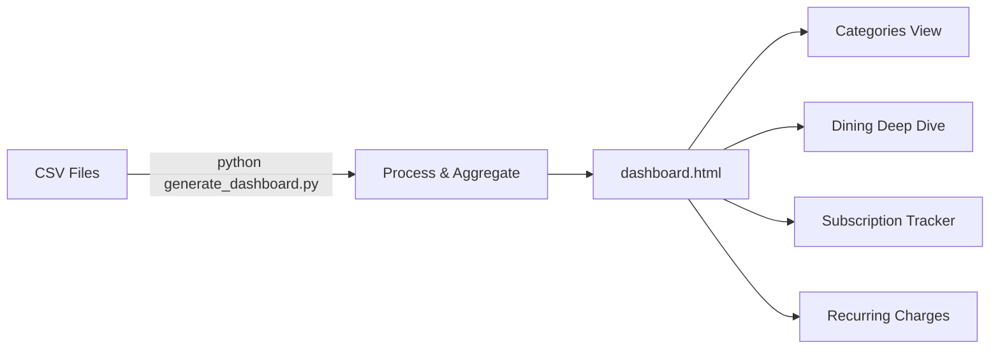

<a id="readme-top"></a>

<div align="center">
  

  <h1>BudgetTracker</h1>

  <p><strong>AI-powered personal finance analysis built on Claude Code</strong></p>
  <p>Drop in your credit card CSV exports. Get instant spending analysis, savings recommendations, and interactive dashboards — powered by custom slash commands and strict data integrity rules.</p>

  <br />


  <br />

  <a href="#-quick-start">Quick Start</a>
  &middot;
  <a href="#-slash-commands">Commands</a>
  &middot;
  <a href="#-dashboard">Dashboard</a>
  &middot;
  <a href="#-customizing">Customize</a>

</div>

<br />

---

## What This Is

This is a working example of using **Claude Code's custom slash commands** and **project instructions** (`CLAUDE.md`) to build a domain-specific AI assistant for personal finance.

<table>
<tr>
<td width="50%">

### The Problem

LLMs confidently report plausible-but-wrong financial figures. Ask "what did I spend on dining?" and you'll get a believable number — that's completely made up from pattern matching, not calculation.

</td>
<td width="50%">

### The Solution

Every slash command in this project **forces Claude to load the CSV, run pandas calculations, and report exact figures**. Prohibited phrases like "approximately" and "I estimate" are enforced at the instruction level.

</td>
</tr>
</table>

<p align="right">(<a href="#readme-top">back to top</a>)</p>

---

## Key Features

- **7 Custom Slash Commands** — Repeatable financial analysis workflows for spending, savings, budgets, and comparisons
- **Strict Data Integrity** — Every number must come from a real calculation; guessing is architecturally prevented
- **Interactive HTML Dashboard** — D3.js-powered visualization with drill-down, filtering, and subscription tracking
- **Multi-Format CSV Support** — Handles different credit card export formats automatically
- **Privacy-First** — `.gitignore` excludes all personal financial data; only tooling is tracked

<p align="right">(<a href="#readme-top">back to top</a>)</p>

---

## Quick Start

> [!TIP]
> A sample CSV with 103 fake transactions is included so you can try every command immediately.

1. **Clone this repo**
   ```bash
   git clone https://github.com/MVP-Club-AI/budgetanalysistool.git
   cd budgetanalysistool
   ```

2. **Add your data** — Export transactions from your credit card provider and place the CSV in `data/`

   Expected format:
   ```
   Date,Amount,Card,Category,Description
   "01/15/2026","42.50","...1234","Dining","CHIPOTLE MEXICAN GRILL"
   ```

3. **Open with Claude Code**
   ```bash
   claude
   ```

4. **Run a command** — Try `/quick-summary` or `/analyze-spending`

<p align="right">(<a href="#readme-top">back to top</a>)</p>

---

## Slash Commands

| Command | What It Does |
| :--- | :--- |
| `/quick-summary` | Fast overview — totals, top categories, top merchants |
| `/analyze-spending` | Comprehensive analysis with trends, day-of-week patterns, velocity |
| `/monthly-report` | Monthly breakdown with month-over-month comparison |
| `/find-savings` | Recurring charges, subscription bloat, category reduction targets |
| `/category-breakdown` | Deep dive into a specific category (e.g., Dining, Grocery) |
| `/compare-periods` | Side-by-side comparison of any two months |
| `/budget-plan` | Budget based on historical spending using 50/30/20 framework |

<details>
<summary><strong>How the commands enforce data integrity</strong></summary>

<br />

Every command follows the same strict protocol defined in `.claude/DATA_RULES.md`:

1. **Load the CSV fresh** — never rely on memory
2. **Parse amounts as numeric** — `pd.to_numeric(df['Amount'], errors='coerce')`
3. **Calculate with pandas** — no mental math, ever
4. **Verify totals** — category breakdowns must sum to overall total
5. **Report exact figures** — `$1,234.56`, not "around $1,200"

**Prohibited phrases** in all command output:

```diff
- "approximately" / "roughly" / "about" / "around"
- "I estimate" / "I think" / "probably"
- "based on my understanding"
```

**Required approach:**

```diff
+ "The data shows $1,234.56"
+ "The calculation shows 23.4%"
+ "Based on the data, dining increased by $87.23"
```

</details>

<p align="right">(<a href="#readme-top">back to top</a>)</p>

---

## Dashboard

Generate an interactive HTML dashboard from your transaction data:

```bash
python scripts/generate_dashboard.py
```

Then open `reports/dashboard.html` in your browser.



**Dashboard views:**

| View | Description |
| :--- | :--- |
| **Categories** | Funnel chart with click-to-drill-down transaction details |
| **Dining** | Transaction size distribution, monthly trends, high-value alerts |
| **Subscriptions** | Expected vs actual costs, billing cycle tracking, status indicators |
| **Recurring** | Auto-detected recurring merchants with frequency and totals |

All views support year/month filtering and interactive tooltips.

<p align="right">(<a href="#readme-top">back to top</a>)</p>

---

## Project Structure

<details>
<summary><strong>Click to expand directory tree</strong></summary>

<br />

```
budgetanalysistool/
├── CLAUDE.md                          # Project instructions for Claude Code
├── .claude/
│   ├── commands/                      # Slash command definitions
│   │   ├── quick-summary.md
│   │   ├── analyze-spending.md
│   │   ├── monthly-report.md
│   │   ├── find-savings.md
│   │   ├── category-breakdown.md
│   │   ├── compare-periods.md
│   │   └── budget-plan.md
│   ├── DATA_RULES.md                  # Data integrity enforcement rules
│   └── settings.local.json            # Claude Code permissions
├── data/                              # Your transaction CSVs go here
│   └── sample-transactions.csv        # 103 fake transactions for demo
├── reports/                           # Generated analysis reports
├── budgets/                           # Generated budget plans
├── scripts/
│   ├── analysis.py                    # Core analysis utilities (pandas)
│   ├── visualize.py                   # Chart generation (matplotlib)
│   ├── generate_dashboard.py          # Interactive HTML dashboard
│   ├── generate_business_dashboard.py # Side project expense tracker
│   └── create_icon.py                 # App icon generator
└── .gitignore                         # Keeps personal data out of VCS
```

</details>

<p align="right">(<a href="#readme-top">back to top</a>)</p>

---

## Customizing

<details>
<summary><strong>Your Own Data</strong></summary>

<br />

Replace the sample CSV in `data/` with your own credit card export. The system expects these columns:

| Column | Type | Description |
| :--- | :--- | :--- |
| `Date` | `MM/DD/YYYY` | Transaction date |
| `Amount` | Decimal | Positive = purchase, negative = refund |
| `Card` | String | Last 4 digits of card |
| `Category` | String | Spending category |
| `Description` | String | Merchant name |

</details>

<details>
<summary><strong>Subscription Tracking</strong></summary>

<br />

Edit the `SUBSCRIPTIONS` array in `scripts/generate_dashboard.py` to match your actual subscriptions. Each entry has:
- **name** — Display name
- **patterns** — Merchant name patterns to match in the CSV
- **amount** — Expected charge amount
- **cycle** — `monthly`, `annual`, or `biannual`
- **tolerance** — How much variance to allow when matching

</details>

<details>
<summary><strong>Business Expenses</strong></summary>

<br />

Edit `scripts/generate_business_dashboard.py` to categorize business-related transactions. Customize the `categorize_business_expense()` function with your own service name patterns and categories.

</details>

<details>
<summary><strong>Budget Categories</strong></summary>

<br />

The budget planner classifies categories as "Needs" vs "Wants" using the 50/30/20 framework. Adjust the `needs_categories` and `wants_categories` lists in the `/budget-plan` command to match your spending patterns.

</details>

<p align="right">(<a href="#readme-top">back to top</a>)</p>

---

## Requirements

| Requirement | Details |
| :--- | :--- |
| **Claude Code** | [CLI tool](https://docs.anthropic.com/en/docs/claude-code) from Anthropic |
| **Python 3.8+** | With `pandas` and `matplotlib` for scripts |
| **Transaction CSV** | From any credit card provider that exports CSV |

---

## Privacy

> [!IMPORTANT]
> The `.gitignore` is configured to exclude all personal financial data — `data/`, `reports/`, `budgets/`, and `*.sqlite` files are never tracked. Only the tooling, commands, and scripts are in version control.

---

<div align="center">

Built with [Claude Code](https://docs.anthropic.com/en/docs/claude-code)

</div>
