<a id="readme-top"></a>

<div align="center">
  

  <h1>BudgetTracker</h1>

  <p><strong>AI-powered personal finance analysis built on Claude Code</strong></p>
  <p>Export your credit card transactions. Drop them in a folder. Ask questions about your money.<br/>Claude does all the coding, math, and visualization for you.</p>

  <br />


  <br />

  <a href="#-quick-start">Quick Start</a>
  &middot;
  <a href="#-what-you-can-do">What You Can Do</a>
  &middot;
  <a href="#-getting-your-data">Getting Your Data</a>
  &middot;
  <a href="#-dashboard">Dashboard</a>

</div>

<br />

> [!NOTE]
> **No coding experience needed.** This project is designed for people who use Claude Code as their developer. You type plain English commands — Claude handles all the code, calculations, and report generation. You never need to read or edit any Python files.

---

## How It Works

This project turns Claude Code into a **personal finance analyst** that works with your real credit card data. Here's the idea in plain English:

```mermaid
flowchart LR
    A["🏦 Download transactions\nfrom your bank"] --> B["📂 Drop the file\nin the data folder"]
    B --> C["💬 Type a command\nlike /quick-summary"]
    C --> D["📊 Get exact answers\nabout your spending"]
```



**You** do steps 1-3. **Claude** does everything else — reading your data, running the math, generating reports, and building charts.

<table>
<tr>
<td width="50%">

### Why not just ask ChatGPT about my spending?

If you paste your transactions into a regular AI chat and ask "what did I spend on dining?", it will give you a confident answer — **that's often wrong.** LLMs are pattern-matchers, not calculators. They'll say "about $1,200" when the real number is $847.23.

</td>
<td width="50%">

### How is this different?

This project has built-in rules that **prevent Claude from guessing.** Every number must come from an actual calculation on your real data. If Claude can't calculate something, it says so — instead of making up a plausible-sounding number.

</td>
</tr>
</table>

<p align="right">(<a href="#readme-top">back to top</a>)</p>

---

## What You Can Do

Type any of these commands after opening the project in Claude Code. Each one reads your actual transaction data and gives you exact numbers — no estimates, no rounding, no guesswork.

| Command | What It Does |
| :--- | :--- |
| `/quick-summary` | Shows your total spending, top 5 categories, and top 5 merchants at a glance |
| `/analyze-spending` | Full deep-dive — where your money goes, which days you spend most, how spending is trending over time |
| `/monthly-report` | Breaks down a single month and compares it to the previous month, so you can see what changed |
| `/find-savings` | Finds every subscription you're paying for, flags ones you might have forgotten, and calculates exactly how much you'd save by cutting specific expenses |
| `/category-breakdown` | Pick a category like "Dining" or "Grocery" and get a complete breakdown — which restaurants, how often, average bill size, busiest days |
| `/compare-periods` | Compare any two months side by side — see exactly which categories went up or down and by how much |
| `/budget-plan` | Creates a realistic budget based on your actual spending history, not arbitrary targets |

> [!TIP]
> You can also just talk to Claude in plain English. Ask things like "what did I spend at Starbucks this year?" or "which month was my most expensive?" and Claude will calculate the answer from your data.

### What the output looks like

When you run `/quick-summary`, you'll get something like:

```
QUICK FINANCIAL SUMMARY
==========================
Period: 11/01/2025 to 01/31/2026

TOTALS
---------
Gross Spending: $5,832.17 (103 purchases)
Refunds/Credits: -$236.11 (3 refunds)
Net Spending: $5,596.06
Daily Average: $63.40

TOP 5 CATEGORIES
-------------------
1. Grocery - $1,487.32 (25.5%)
2. Dining - $1,203.84 (20.6%)
3. Merchandise - $892.41 (15.3%)
4. Gas/Automotive - $551.00 (9.4%)
5. Other Services - $490.00 (8.4%)
```

Every number is calculated from your actual data. Nothing is estimated or rounded for convenience.

<p align="right">(<a href="#readme-top">back to top</a>)</p>

---

## Quick Start

> [!TIP]
> **Want to try it before using your own data?** A sample file with 103 fake transactions is already included. You can run every command right away to see how it works.

### Step 1: Get the project

Open a terminal (or ask Claude Code to do this for you) and run:

```bash
git clone https://github.com/MVP-Club-AI/budgetanalysistool.git
cd budgetanalysistool
```

This downloads the project to your computer.

### Step 2: Open it in Claude Code

```bash
claude
```

That's it. Claude Code will read the project instructions automatically and know what to do.

### Step 3: Try a command

Type `/quick-summary` and press Enter. Claude will read the sample transaction data and give you a full spending breakdown.

### Step 4: Add your own data (when ready)

See the [Getting Your Data](#-getting-your-data) section below for step-by-step instructions on downloading your transactions from your bank.

<p align="right">(<a href="#readme-top">back to top</a>)</p>

---

## Getting Your Data

Your credit card company lets you download your transactions as a spreadsheet file (called a CSV). Here's how to get it from the most common providers:

<details>
<summary><strong>Capital One</strong></summary>

<br />

1. Log in to your account at capitalone.com
2. Click on the credit card you want to analyze
3. Click **"View Statements & Activity"** or go to the **Transactions** page
4. Look for a **"Download Transactions"** link (usually near the top right of the transaction list)
5. Select your date range (the wider the range, the better the analysis)
6. Choose **CSV** as the format
7. Save the file into the `data/` folder inside this project

</details>

<details>
<summary><strong>Chase</strong></summary>

<br />

1. Log in at chase.com
2. Click on your credit card account
3. Click **"Download account activity"** (look for a download icon near the transaction search)
4. Set your date range
5. Select **CSV** as the file type
6. Click **Download**
7. Move the downloaded file into the `data/` folder inside this project

</details>

<details>
<summary><strong>American Express</strong></summary>

<br />

1. Log in at americanexpress.com
2. Go to **"Statements & Activity"**
3. Click **"Download Your Statement Data"** (you may need to scroll down)
4. Select your date range
5. Choose **CSV** format
6. Download and move the file into the `data/` folder

</details>

<details>
<summary><strong>Discover</strong></summary>

<br />

1. Log in at discover.com
2. Go to your card's **Activity** page
3. Click **"Download to Spreadsheet"** or the **Export** option
4. Select your date range and choose **CSV**
5. Save the file into the `data/` folder

</details>

<details>
<summary><strong>Other Banks</strong></summary>

<br />

Most banks and credit card companies offer CSV downloads. Look for:
- **"Download"**, **"Export"**, or **"Download Transactions"** buttons on your transaction history page
- A date range selector — pick the widest range available for better analysis
- A format option — always choose **CSV** (not PDF, not OFX)

If your bank's CSV has different column names, don't worry — just tell Claude and it will adapt the code to read your format.

</details>

> [!IMPORTANT]
> **Your financial data stays on your computer.** The CSV files you put in the `data/` folder are never uploaded anywhere. Claude Code runs locally. The `.gitignore` file ensures your data is excluded from version control, so even if you push this project to GitHub, your personal data won't go with it.

<p align="right">(<a href="#readme-top">back to top</a>)</p>

---

## Dashboard

Beyond the text-based commands, you can generate a visual, interactive dashboard that opens in your browser.

Just ask Claude: **"generate the dashboard"** — or run the script directly:

```bash
python scripts/generate_dashboard.py
```

Then open `reports/dashboard.html` in your browser.


**What the dashboard shows you:**

| View | What You'll See |
| :--- | :--- |
| **Categories** | A visual bar chart of where your money goes — click any category to see every transaction in it |
| **Dining** | How much you spend eating out, your average bill size, which price range is most common, monthly trends |
| **Subscriptions** | Every subscription it can find in your data, what you're expected to pay vs what you actually paid, and which ones are still active |
| **Recurring** | Any merchant that charges you more than once — helps you spot things you didn't realize you were paying for repeatedly |

All views let you filter by year and month, and you can click on anything to see the underlying transactions.

<p align="right">(<a href="#readme-top">back to top</a>)</p>

---

## Frequently Asked Questions

<details>
<summary><strong>Do I need to know how to code?</strong></summary>

<br />

**No.** Claude Code handles all the programming. You just type commands in plain English (or use the slash commands like `/quick-summary`). The Python scripts and code in this project are there for Claude to use — you never need to open or edit them unless you want to.

</details>

<details>
<summary><strong>Is my financial data safe?</strong></summary>

<br />

**Yes.** Everything runs locally on your computer. Your CSV files are never uploaded to any server. Claude Code processes your data right on your machine. The `.gitignore` file also prevents your data from being accidentally committed to GitHub.

</details>

<details>
<summary><strong>What if my bank's CSV format is different?</strong></summary>

<br />

Just tell Claude. Say something like: "My CSV has columns called Transaction Date, Posted Date, and Debit instead of Date and Amount" — and Claude will adjust the code to read your format. The dashboard generator already handles multiple formats automatically.

</details>

<details>
<summary><strong>Can I ask questions beyond the slash commands?</strong></summary>

<br />

Absolutely. The slash commands are pre-built workflows for common analyses, but you can ask Claude anything about your spending in plain English:

- *"How much did I spend at Amazon this year?"*
- *"Which month did I spend the least on groceries?"*
- *"Show me all transactions over $100"*
- *"What's my average weekly spending?"*
- *"Am I spending more on dining this month compared to last month?"*

Claude will read your CSV and calculate the exact answer.

</details>

<details>
<summary><strong>What if I want to customize something?</strong></summary>

<br />

Just ask Claude in plain English. For example:
- *"Add my Netflix subscription to the subscription tracker — it's $15.49/month"*
- *"Change the dining budget target from $800 to $600"*
- *"Add a new category for pet expenses"*

Claude will make the code changes for you. You don't need to edit any files yourself.

</details>

<details>
<summary><strong>How far back can I analyze?</strong></summary>

<br />

As far back as your bank lets you download. Most banks offer 1-2 years of transaction history as CSV. You can put multiple CSV files in the `data/` folder and the system will combine them automatically.

</details>

<p align="right">(<a href="#readme-top">back to top</a>)</p>

---

## Under the Hood

<details>
<summary><strong>For the technically curious — how the data integrity system works</strong></summary>

<br />

Every command follows the same strict protocol defined in `CLAUDE.md` and `.claude/DATA_RULES.md`:

1. **Load the CSV fresh** — never rely on memory or previous calculations
2. **Parse amounts as numeric** — `pd.to_numeric(df['Amount'], errors='coerce')`
3. **Calculate with pandas** — no mental math, ever
4. **Verify totals** — category breakdowns must sum to overall total
5. **Report exact figures** — `$1,234.56`, not "around $1,200"

**Prohibited phrases** in all command output:

```diff
- "approximately" / "roughly" / "about" / "around"
- "I estimate" / "I think" / "probably"
- "based on my understanding"
```

**Required approach:**

```diff
+ "The data shows $1,234.56"
+ "The calculation shows 23.4%"
+ "Based on the data, dining increased by $87.23"
```

This works because Claude Code reads the `CLAUDE.md` file at the start of every session. The instructions in that file override Claude's default behavior, making it impossible for the AI to fall back on guessing.

</details>

<details>
<summary><strong>Project structure</strong></summary>

<br />

```
budgetanalysistool/
├── CLAUDE.md                          # Project instructions for Claude Code
├── .claude/
│   ├── commands/                      # Slash command definitions
│   │   ├── quick-summary.md
│   │   ├── analyze-spending.md
│   │   ├── monthly-report.md
│   │   ├── find-savings.md
│   │   ├── category-breakdown.md
│   │   ├── compare-periods.md
│   │   └── budget-plan.md
│   ├── DATA_RULES.md                  # Data integrity enforcement rules
│   └── settings.local.json            # Claude Code permissions
├── data/                              # Your transaction CSVs go here
│   └── sample-transactions.csv        # 103 fake transactions for demo
├── reports/                           # Generated analysis reports
├── budgets/                           # Generated budget plans
├── scripts/
│   ├── analysis.py                    # Core analysis utilities (pandas)
│   ├── visualize.py                   # Chart generation (matplotlib)
│   ├── generate_dashboard.py          # Interactive HTML dashboard
│   ├── generate_business_dashboard.py # Side project expense tracker
│   └── create_icon.py                 # App icon generator
└── .gitignore                         # Keeps personal data out of VCS
```

</details>

<details>
<summary><strong>Customizing for power users</strong></summary>

<br />

**Your Own Data Format:**
The system expects columns named `Date`, `Amount`, `Card`, `Category`, `Description`. If your bank uses different names, tell Claude and it will adapt.

**Subscription Tracking:**
Edit the `SUBSCRIPTIONS` array in `scripts/generate_dashboard.py` to match your actual subscriptions — or just ask Claude to do it for you.

**Business Expenses:**
The `scripts/generate_business_dashboard.py` file tracks expenses for a side project. Customize the `categorize_business_expense()` function with your own vendor patterns.

**Budget Framework:**
The budget planner uses the 50/30/20 rule (50% needs, 30% wants, 20% savings). Adjust the category classifications in the `/budget-plan` command to match your life.

</details>

<p align="right">(<a href="#readme-top">back to top</a>)</p>

---

## Requirements

| What You Need | Why |
| :--- | :--- |
| **[Claude Code](https://docs.anthropic.com/en/docs/claude-code)** | The AI assistant that reads your data and runs the analysis |
| **Python 3.8+** | The programming language Claude uses behind the scenes (you won't interact with it directly) |
| **A credit card CSV** | Your transaction data — see [Getting Your Data](#-getting-your-data) above |

> [!TIP]
> If you don't have Python installed, just ask Claude: *"Help me install Python"* — it will walk you through it for your operating system.

---

## Privacy

> [!IMPORTANT]
> **Your financial data never leaves your computer.** Claude Code runs locally. The `.gitignore` is configured to exclude all personal data — `data/`, `reports/`, `budgets/`, and `*.sqlite` files are never tracked in version control. Only the tooling, commands, and scripts are shared.

---

<div align="center">

Built with [Claude Code](https://docs.anthropic.com/en/docs/claude-code)

</div>
